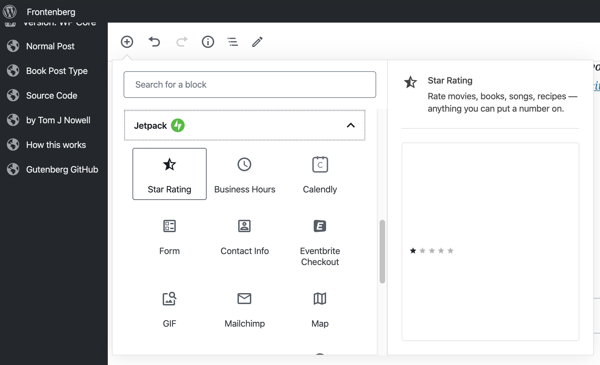
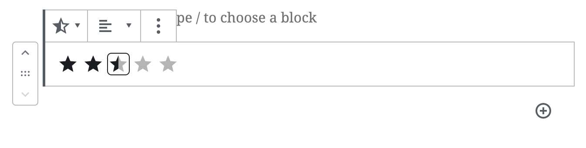
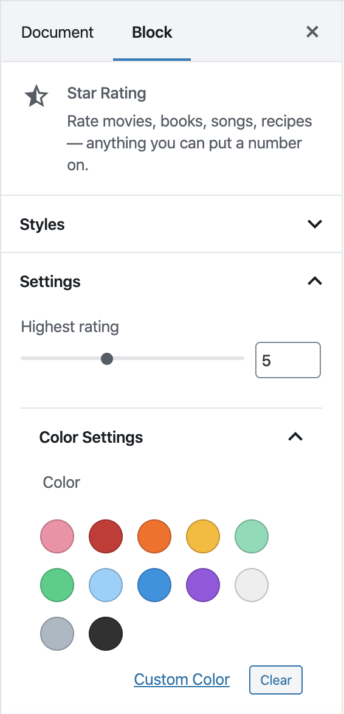

# Mobile Gutenberg (Gutenberg Day edition)

This is the mobile version of [Gutenberg](https://github.com/WordPress/gutenberg), targeting Android and iOS. It's a React Native library bootstrapped by CRNA and now ejected.

## Getting Started

### Prerequisites

For a developer experience closer to the one the project maintainers current have, make sure you have the following tools installed:

* git
* [nvm](https://github.com/creationix/nvm)
* Node.js and npm (use nvm to install them)
* yarn (`npm install -g yarn`)
* [AndroidStudio](https://developer.android.com/studio/) to be able to compile the Android version of the app
* [Xcode](https://developer.apple.com/xcode/) to be able to compile the iOS app
* [Carthage](https://github.com/Carthage/Carthage#installing-carthage) needed for fetching the Aztec dependency.

Note that the OS platform used by the maintainers is macOS but the tools and setup should be usable in other platforms too.

* Clone the project and submodules:
```
git clone --recurse-submodules https://github.com/Tug/gutenberg-mobile.git
git checkout gutenberg-day-programming-session
```

* Or if you already have the project cloned, initialize and update the submodules:
```
git submodule update --init
```

Before running the demo app, you need to download and install the project dependencies. This is done via the following command:

```
nvm install --latest-npm
yarn install
```

### Start a development environment

For this exercise we won't be needing a WordPress native app, the demo app contained within gutenberg-mobile will suffice.

Boot the project on your platform of choice using the following commands:
- `yarn start:reset`

Wait until you see the metro screen:
```
┌──────────────────────────────────────────────────────────────────────────────┐
│                                                                              │
│  Running Metro Bundler on port 8081.                                         │
│                                                                              │
│  Keep Metro running while developing on any JS projects. Feel free to        │
│  close this tab and run your own Metro instance if you prefer.               │
│                                                                              │
│  https://github.com/facebook/react-native                                    │
│                                                                              │
└──────────────────────────────────────────────────────────────────────────────┘
```
Open another terminal and run
- `yarn android` for Android or
- `yarn ios` for iOS


## Exercise Instructions

The goal of this exercise will be to (re-)create the Star Rating block from Jetpack on mobile.
Take some time to familiarize yourself with this block on the web first.
For this, go to [Frontendberg](https://frontenberg.tomjn.com/) and insert a "Rating Star" block.





Notice the right sidebar and the different settings this block has:



## Open the demo app

Make sure the app loads on your device.
Notice that a "Star Rating" block is already available when you tap on the Inserter.
Try to insert onw into the document and notice its current limitation.
Open the [Rating Star block code](./extra-blocks/rating-star/index.js) and
familiarize yourself with the code.

### Adjust the rating by tapping on a star

Currently, the Rating Star block is just a react-native Text component which displays star emojis when in edit mode.
Let's make it listen for touch events and adjust its rating accordingly.

...

### Make the highest rating adjustable

...

### Make the color of the stars adjustable

...

### Support 2 styles for the stars (Filled and outlined)

...

